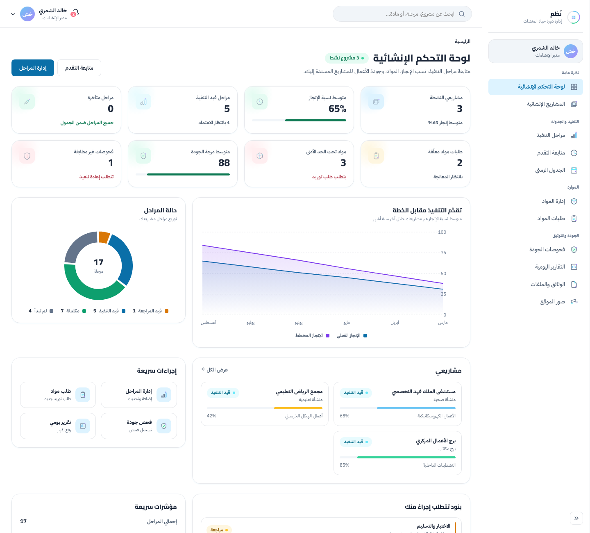
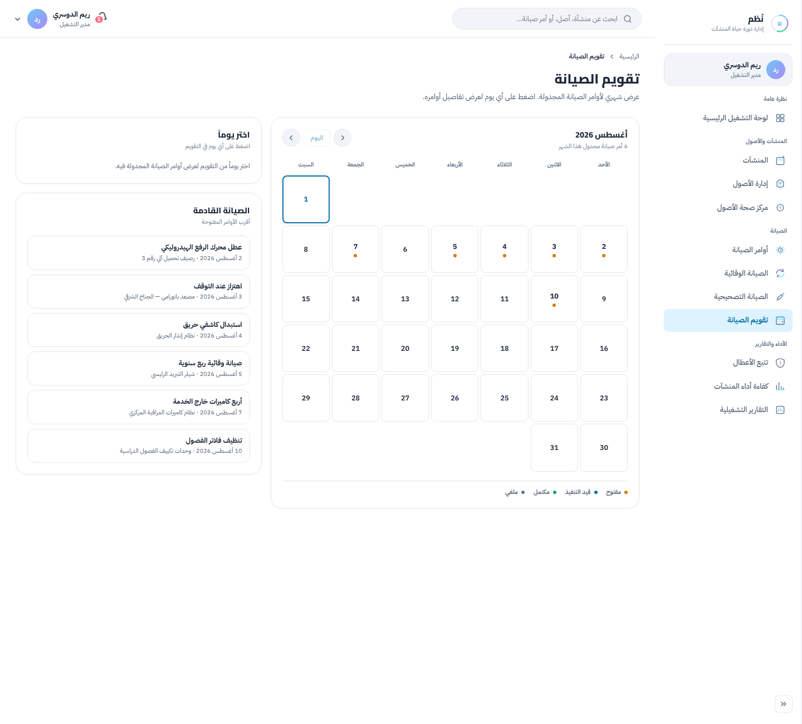
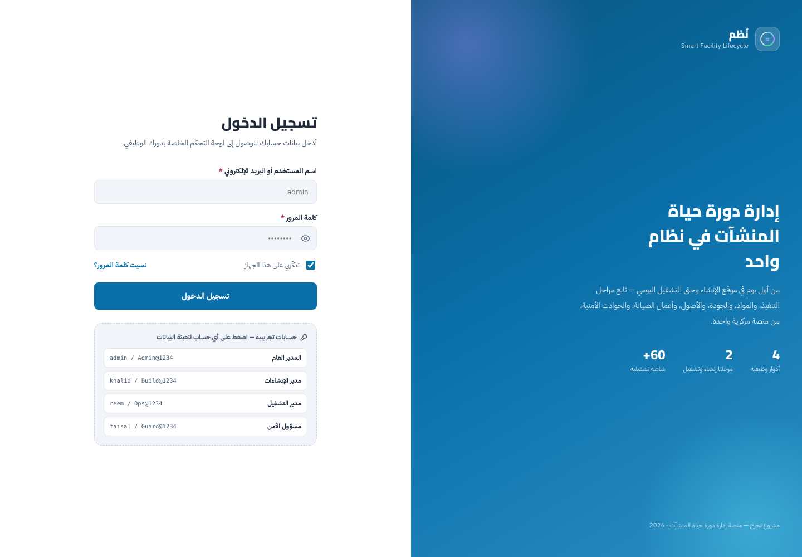
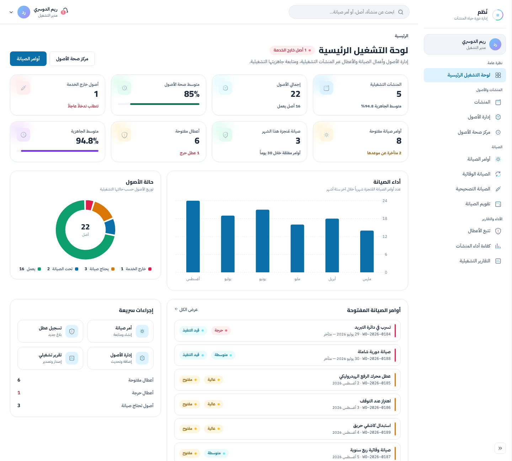
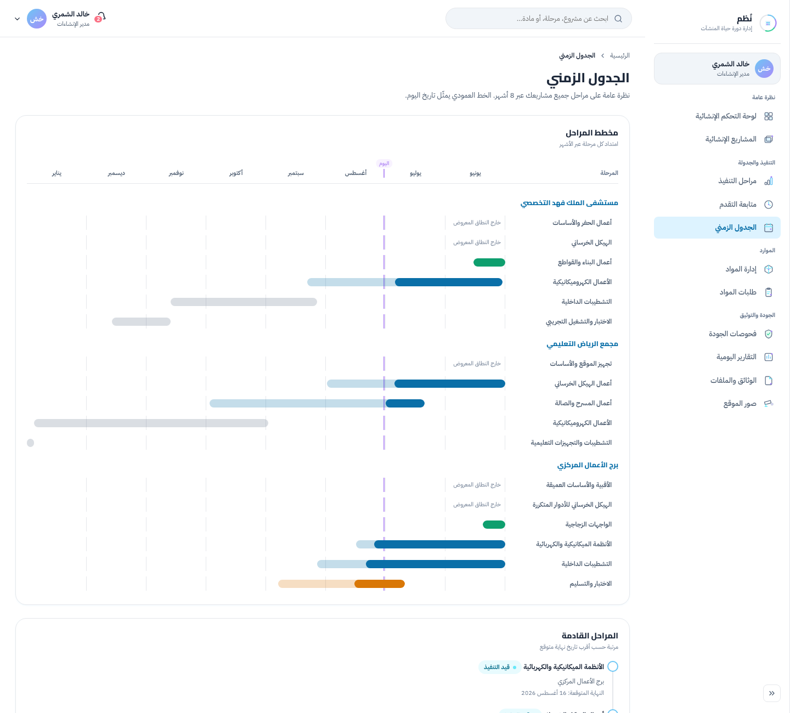
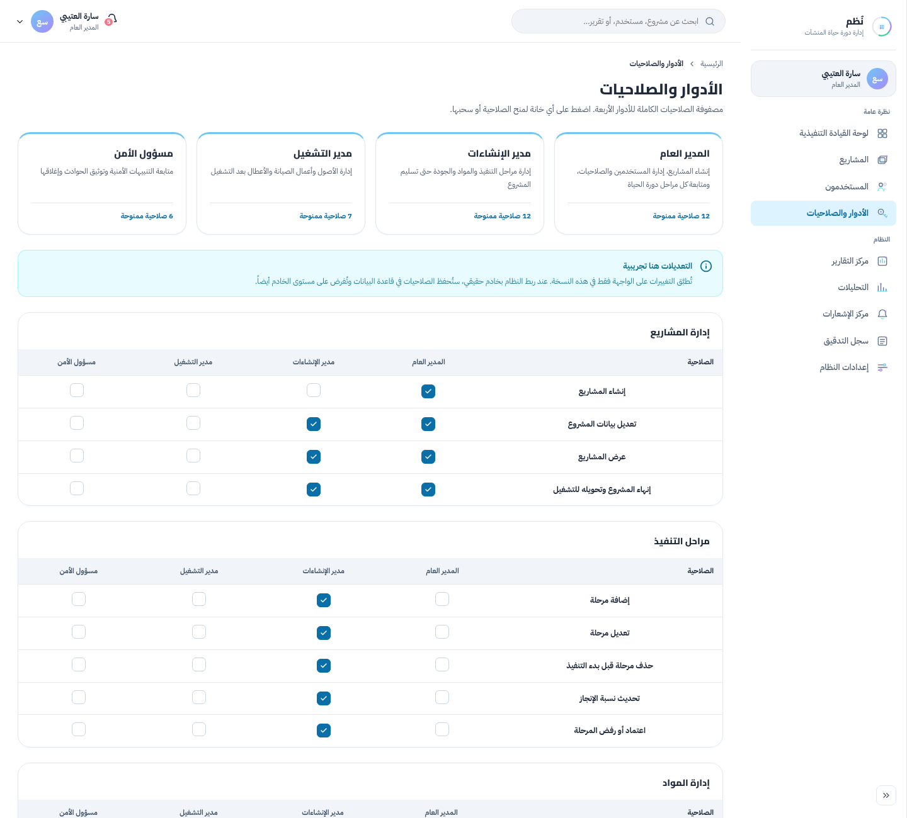

<div align="center">

# 🏗️ Smart Facility Monitoring System (SFMS)

> **An AI-Driven Dual-Phase Computer Vision Solution for Construction Site Safety & Post-Delivery Automated Security.**

[](https://www.python.org/)
[](https://pytorch.org/)
[](https://ultralytics.com/)
[](https://react.dev/)
[](https://www.typescriptlang.org/)

</div>

---

## 📌 About The Project

The **Smart Facility Monitoring System (SFMS)** is an end-to-end real-time computer vision platform engineered to bridge the operational gap between facility construction management and post-delivery facility operations.

It combines custom-trained **YOLO** detection models with a full **React + TypeScript** management dashboard, providing continuous automated site surveillance, proactive hazard mitigation, and intelligent perimeter management.

> **Current state:** the detection models and the web frontend are built and working independently. The backend layer that connects them is the remaining integration work — see the Roadmap at the bottom of this page.

---

## 🎯 Dual-Phase Operations Workflow

### 1. 🏗️ Under-Construction Phase
* **Heavy Vehicle & Truck ALPR Tracking:** Automated license plate recognition and logging for material delivery trucks, concrete mixers, and contractor vehicles entering the active construction site to secure the logistics chain and manage site access.
* **Fire & Smoke Hazard Detection:** Early warning detection for uncontained fires or smoke emissions across open construction zones and material storage yards.
* **Perimeter Intrusion Surveillance:** Monitors restricted entry points and off-limits construction areas during off-hours to prevent theft and unauthorized entry.

### 2. 🏢 Post-Delivery (Facility Management) Phase
* **Advanced Passenger Vehicle ALPR:** Streamlined vehicle entry/exit management for tenants, visitors, and service units.
* **Continuous Safety Surveillance:** 24/7 automated fire and smoke detection across residential and commercial indoor/outdoor zones.
* **Real-Time Security Dashboard:** Incident logging, analytics, and alerting for security operators.

---

## 📊 Model Performance Metrics

Metrics below are taken from the **best checkpoint** of each training run (the epoch Ultralytics saves as `best.pt`), read directly from each run's `Results/Train/results.csv`.

| Detection Task | Architecture | Dataset | mAP@50 | mAP@50-95 | Precision | Recall | Status |
| --- | --- | --- | --- | --- | --- | --- | --- |
| **Fire & Smoke Detection** | YOLO26-Medium | 11,000+ images | **78.8%** | 46.2% | 78.2% | 71.2% | 🟢 Deployed |
| **ALPR — Plate Detection (base)** | YOLO26-Nano | 10,116 images | **97.2%** | 66.6% | 98.9% | 94.7% | 🔵 Base checkpoint for the fine-tune |
| **ALPR — Syrian Plates (fine-tuned)** | YOLO26-Nano (transfer learning) | 393 images | **99.4%** | 81.2% | 99.3% | 97.6% | 🟢 Deployed |
| **Perimeter Intrusion** | YOLO26-Nano | — | — | — | — | — | ⚪ Not in this repo yet |

**The fine-tuned Syrian-plates model is the one wired into the ALPR pipeline** — it was produced by taking the base plate detector as its starting checkpoint and fine-tuning it on a Syrian-plate–specific dataset, which lifted mAP@50-95 from 66.6% → 81.2%.

---

## 🧠 Detection Pipelines

Detection alone isn't enough for either use case — both pipelines add tracking, temporal confirmation, and domain logic on top of raw YOLO output so that a single bad frame can't produce a wrong result.

### 🚗 ALPR — Plate Recognition

| Stage | What it does |
| --- | --- |
| **Detect & track** | YOLO26n plate detection with ByteTrack, giving each plate a persistent ID across frames. |
| **Read** | EasyOCR restricted to digits, run on a 5× upscaled crop enhanced with CLAHE + unsharp masking. |
| **Parse** | Handles both Syrian plate layouts — wide (`15-14193`, a 2-digit and a 5-digit group) and tall (`541-5134`, 3 digits over 4) — selected by the plate box's aspect ratio. |
| **Confirm** | Confidence-weighted voting over each track's reading history; a plate is only confirmed after several agreeing reads, so one bad frame can't decide the number. |
| **Classify vehicle** | Each plate is matched to the smallest enclosing vehicle box from a COCO YOLO model, then smoothed by majority vote into `CAR` / `Truck`. |
| **Direction** | Logs an **IN/OUT** crossing event when a tracked plate crosses a configurable virtual line, debounced over consecutive frames. |

### 🔥 Fire & Smoke Detection

| Stage | What it does |
| --- | --- |
| **Detect** | YOLO fire/smoke detection at a confidence threshold of `0.378`, chosen from the test-set F1 curve. |
| **ROI filter** | Optional region of interest — a detection counts only when its box center falls inside the selected region. |
| **Confirm** | An alert fires only after enough positive checks inside a rolling window (currently **3 of 6** for Fire, **4 of 6** for Smoke), preventing single-frame false alarms. |
| **Cooldown** | Per-class cooldown (15s) so one ongoing event doesn't spam repeated alerts. |
| **Deliver** | Threaded capture always serves the newest frame instead of stale buffered ones, and alerts are POSTed asynchronously so network latency never blocks detection. |

---

## 🖥️ Management Dashboard

A full React + TypeScript application — **57 screens**, fully Arabic (RTL), running standalone on built-in fixture data with no backend required.

| Area | Screens | Covers |
| --- | :---: | --- |
| **Construction** | 13 | Projects, stages, timeline, progress, materials & requests, daily reports, quality inspections, site photos, documents |
| **Operations** | 12 | Facilities, assets & asset health, work orders, fault tracking, maintenance calendar, performance, operational reports |
| **Security** | 12 | Alerts & alert history, incidents & analytics, camera monitoring, emergency monitoring, response center, safety documentation |
| **Super Admin** | 10 | Users, roles matrix, projects, analytics, audit logs, system settings, reports |
| **Auth / Shared** | 10 | Login, password reset, profile, notifications, reports, help |

Access is role-based across four roles: `super_admin`, `construction_manager`, `operations_manager`, and `security_officer`.

### 🖼️ Preview

| Security Dashboard | Incident Analytics |
| :---: | :---: |
|  |  |

| Construction Dashboard | Maintenance Calendar |
| :---: | :---: |
|  |  |

<details>
<summary>More screens (login, admin, operations, timeline, roles, incident detail)</summary>

| | |
| :---: | :---: |
|  |  |
|  |  |
|  |  |

</details>

---

## 💡 System Architecture

```text
[ IP / Live Camera Feeds ] ──► [ OpenCV Video Frame Sampler ]
                                         │
                                         ▼
                     [ YOLO Multi-Task Detection Engine ]
                        ├── Fire & Smoke Detector          (built)
                        ├── License Plate Reader + OCR     (built)
                        └── Perimeter Intrusion Detector   (planned)
                                         │
                                         ▼
                     [ Backend API & Event Store ]         (planned)
                        ├── Incident Event Logging
                        └── Alert Triggering System
                                         │
                                         ▼
                     [ React Dashboard ]                   (built)
                        ├── Security / Construction / Operations views
                        ├── Incident analytics & reporting
                        └── Role-based access
```

---

## 📂 Repository Structure

```text
Smart-Facilities-Monitor-System/
├── Models/
│   ├── LicensePLatesDetectionModel(with_OCR)/
│   │   ├── Deployment/                          # runnable ALPR pipeline
│   │   ├── Results/                             # base model training/test results
│   │   └── TransferLearningOnSYDataset(Yolo26n)/  # fine-tuning run + notebook
│   └── SmokeAndFireModel/
│       ├── Deployment/                          # runnable fire/smoke pipeline
│       └── Results/                             # training/test results
├── Smart-Facility-Platform-main_Front_End/      # React + TypeScript dashboard
├── screenshots/                                 # dashboard screenshots
├── .gitignore
└── README.md
```

Each model's `Deployment/` folder is self-contained and has its own README:
* 🚗 [ALPR Deployment](Models/LicensePLatesDetectionModel%28with_OCR%29/Deployment/README.md)
* 🔥 [Fire & Smoke Deployment](Models/SmokeAndFireModel/Deployment/README.md)

> **Note:** trained `.pt` weights are not committed for the ALPR model — place your own `best.pt` in its `Deployment/` folder before running. See that folder's README.

---

## 🛠️ Tech Stack

| Layer | Technologies |
| --- | --- |
| **Deep Learning / CV** | PyTorch, Ultralytics YOLO26, OpenCV, EasyOCR, ByteTrack |
| **Frontend** | React 19, TypeScript, Vite, React Router 7, TanStack Query, Recharts, React Hook Form + Zod |
| **Tooling** | oxlint, Prettier |
| **Training Infrastructure** | Kaggle GPU clusters (CUDA 12.8), Python 3.12, PyTorch 2.10.0 |
| **Local Inference** | Python 3.13, CUDA-enabled PyTorch |
| **Backend** | *Not built yet — planned* |

---

## 🚀 Getting Started

### Run the Dashboard (Frontend)

Requires **Node.js**. The dashboard runs standalone with built-in fixture data — no backend or database needed.

```bash
cd Smart-Facility-Platform-main_Front_End
npm install
npm run dev
```

> The frontend has its own detailed Arabic setup guide: [Smart-Facility-Platform-main_Front_End/README.md](Smart-Facility-Platform-main_Front_End/README.md)

### Run a Detection Pipeline

Requires **Python 3.10+** and a CUDA-enabled GPU for real-time performance.

```bash
cd "Models/LicensePLatesDetectionModel(with_OCR)/Deployment"
pip install -r requirements.txt
python Main.py
```

The same pattern applies to `Models/SmokeAndFireModel/Deployment`. Each pipeline opens an OpenCV window and runs against a local video/camera source configured in its `config.py`. Press **`q`** to stop.

---

## 🗺️ Roadmap

* [x] Train & validate Fire & Smoke Detection model (78.8% mAP@50).
* [x] Train ALPR plate-detection model (97.2% mAP@50).
* [x] Fine-tune ALPR model on Syrian plates via transfer learning (99.4% mAP@50).
* [x] Build ALPR inference pipeline (detection + tracking + OCR + vehicle type + IN/OUT crossing).
* [x] Build Fire & Smoke inference pipeline (detection + ROI + alert confirmation).
* [x] Build React dashboard frontend (60 screens, fully Arabic/RTL).
* [ ] Train Perimeter Intrusion detection model.
* [ ] Build backend API to connect the detection pipelines to the dashboard.
* [ ] Implement WebSocket connection for real-time web notifications.
* [ ] Replace interactive OpenCV windows with headless production entry points.
* [ ] Deploy Docker containerization for production environments.

---

## 📜 License

Distributed under the **MIT License**.
