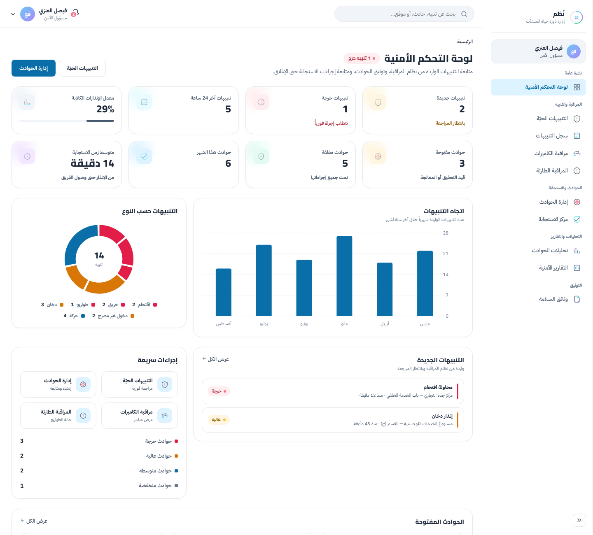
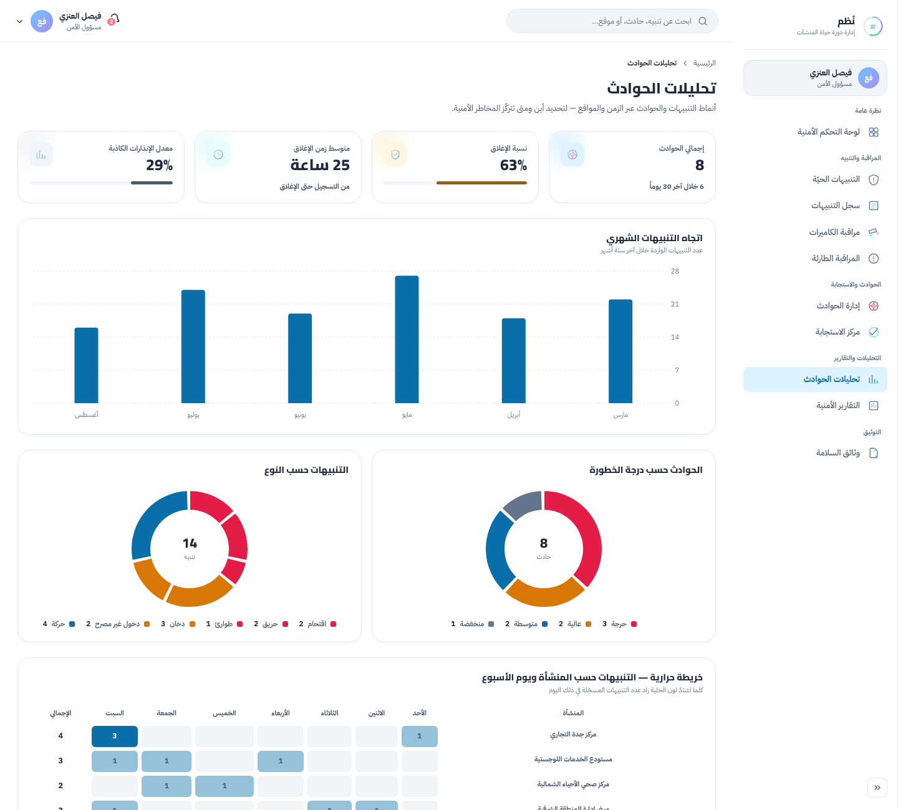
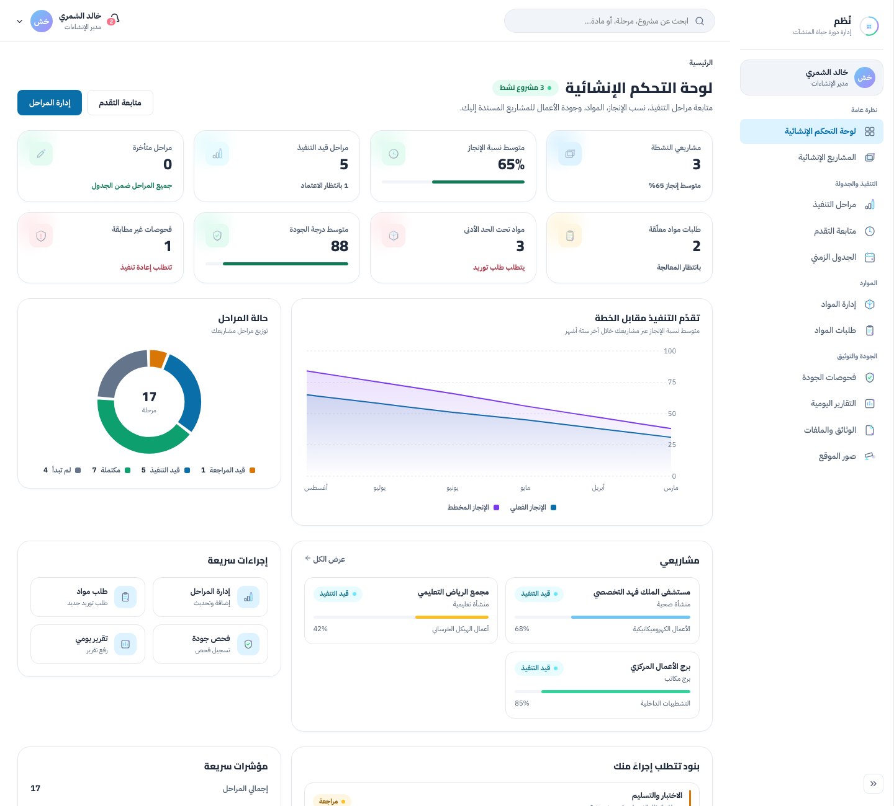
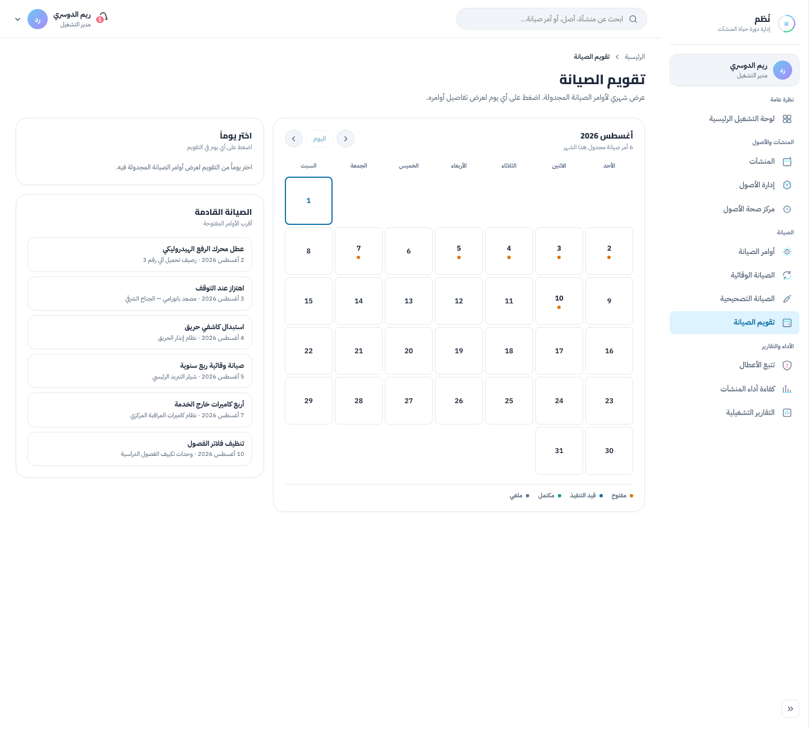
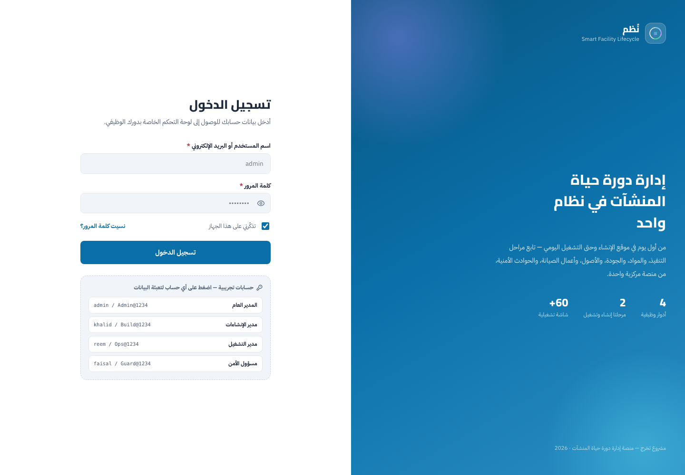
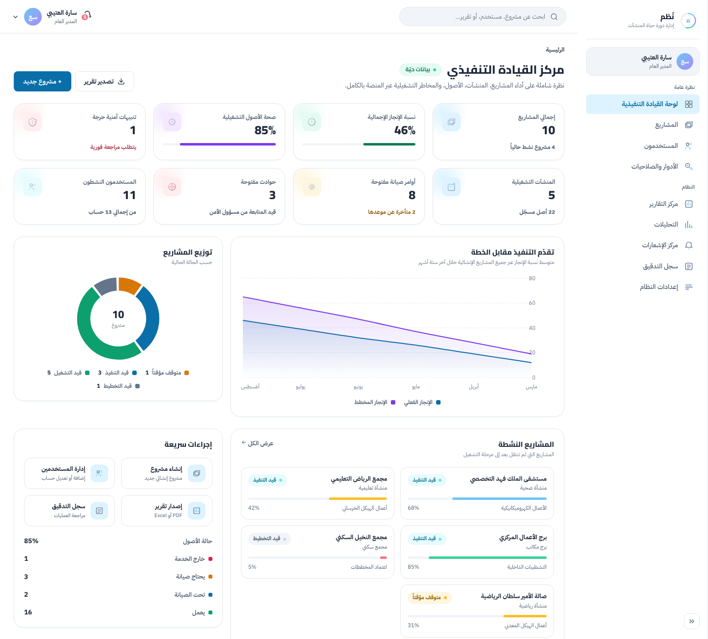
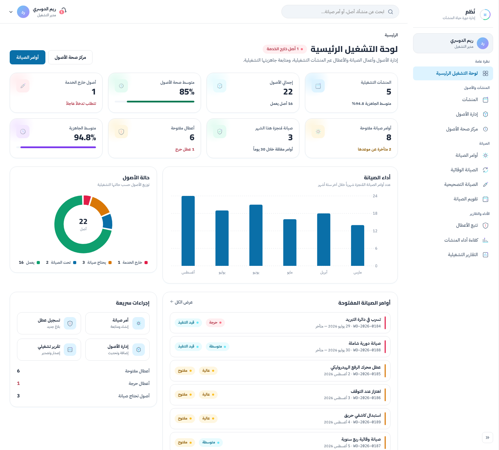
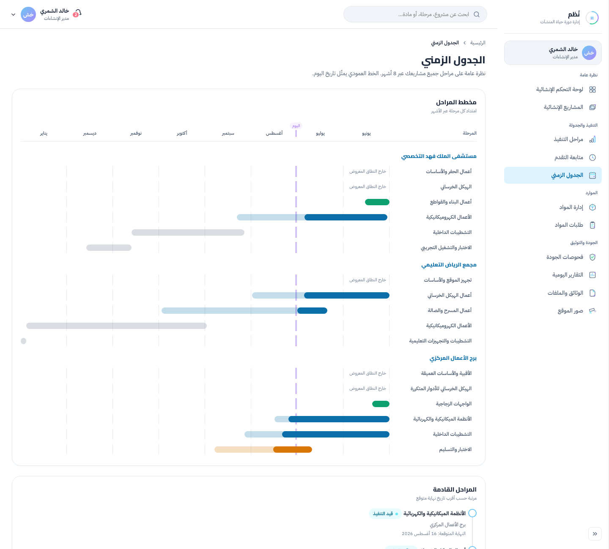
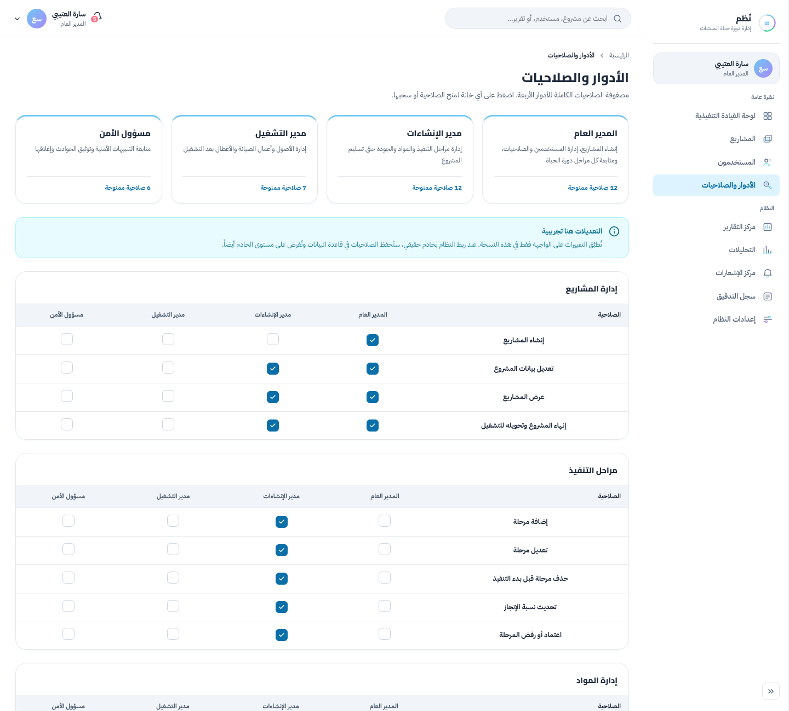
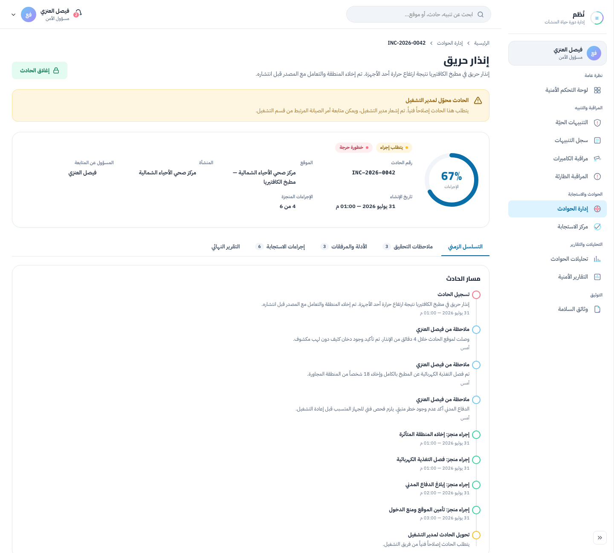

<div align="center">

# 🏗️ Smart Facility Monitoring System (SFMS)

> **An AI-Driven Dual-Phase Computer Vision Solution for Construction Site Safety & Post-Delivery Automated Security.**

[](https://www.python.org/)
[](https://pytorch.org/)
[](https://ultralytics.com/)
[](https://github.com/PaddlePaddle/PaddleOCR)
[](https://react.dev/)
[](https://www.typescriptlang.org/)
[](LICENSE)

</div>

---

## 📌 About The Project

The **Smart Facility Monitoring System (SFMS)** is an end-to-end real-time computer vision platform engineered to bridge the operational gap between facility construction management and post-delivery facility operations.

It combines three **YOLO26** detectors — custom-trained models for fire and smoke and for Syrian licence plates with OCR, and a COCO-pretrained person detector for perimeter intrusion — with a **Django/DRF** backend and a full **React + TypeScript** management dashboard, providing continuous automated site surveillance, proactive hazard mitigation, and intelligent perimeter management.

> **Current state:** the whole loop runs end to end. Each detector runs as its own Docker service, reads the camera stream through a MediaMTX relay, and reports events to the backend's camera-events API under its own machine credential; the dashboard shows the live detector feeds and pushes alerts over WebSockets. The admin switches models per camera and draws intrusion zones and the ANPR virtual line on the live frame. Open items are listed in the Roadmap at the bottom of this page.

---

## 🎯 Dual-Phase Operations Workflow

### 1. 🏗️ Under-Construction Phase
* **Fire & Smoke Hazard Detection:** Early warning detection for uncontained fires or smoke emissions across open construction zones and material storage yards.
* **Heavy Vehicle & Truck ALPR Tracking:** Automated license plate recognition and logging for material delivery trucks, concrete mixers, and contractor vehicles entering the active construction site to secure the logistics chain and manage site access.
* **Perimeter Intrusion Surveillance:** Monitors restricted entry points and off-limits construction areas during off-hours to prevent theft and unauthorized entry.

### 2. 🏢 Post-Delivery (Facility Management) Phase
* **Continuous Safety Surveillance:** 24/7 automated fire and smoke detection across residential and commercial indoor/outdoor zones.
* **Advanced Passenger Vehicle ALPR:** Streamlined vehicle entry/exit management for tenants, visitors, and service units.
* **Real-Time Security Dashboard:** Incident logging, analytics, and alerting for security operators.

---

## 📊 Model Performance Metrics

### Detection

All figures come from the training and test notebooks committed with each model and describe the saved **`best.pt`** checkpoint — the one used by the deployment pipelines. *Validation* is Ultralytics' final evaluation of `best.pt` at the end of training; ***Test*** is a separate evaluation of the same checkpoint on the held-out test split, which the model never saw during training or checkpoint selection.

| Model | Architecture | Split | Images | mAP@50 | mAP@50-95 | Precision | Recall | Status |
| --- | --- | --- | :---: | :---: | :---: | :---: | :---: | --- |
| **Fire & Smoke Detection** | YOLO26-Medium (21.8 M params) | Validation | 3,094 | 78.3% | 47.0% | 78.8% | 71.6% | 🟢 Deployed |
| | | ***Test*** | 4,291 | **80.3%** | **47.0%** | **80.2%** | **74.5%** | |
| **ALPR — Plate Detection (base)** | YOLO26-Nano (2.5 M params) | Validation | 2,000 | 96.3% | 67.1% | 98.3% | 94.9% | 🔵 Base checkpoint for the fine-tune |
| | | ***Test*** | 998 | **96.3%** | **67.3%** | **99.2%** | **94.8%** | |
| **ALPR — Syrian Plates (fine-tuned)** | YOLO26-Nano (transfer learning) | Validation | 41 | 99.4% | 82.5% | 98.9% | 97.6% | 🟢 Deployed |
| | | ***Test*** | 41 | **99.5%** | **88.2%** | **99.6%** | **100%** | |
| **Perimeter Intrusion** | YOLO26-Nano, COCO-pretrained (`person` class) | — | — | — | — | — | — | 🟢 Deployed (ONNX Runtime, CPU) |

**Fire & Smoke — per class (test split).** Fire is the weaker class on every metric:

| Class | Images | Instances | mAP@50 | mAP@50-95 | Precision | Recall |
| --- | :---: | :---: | :---: | :---: | :---: | :---: |
| Smoke | 2,066 | 2,298 | 86.1% | 54.1% | 85.3% | 80.6% |
| Fire | 1,111 | 2,868 | 74.6% | 39.8% | 75.2% | 68.4% |

**The fine-tuned Syrian-plates model is the one wired into the ALPR pipeline.** It was produced by taking the base plate detector as its starting checkpoint and fine-tuning it on the Syrian Plates dataset. The base model's scores are measured on a different, generic plate dataset, so the two rows are not a before/after comparison on the same data; what the fine-tune demonstrates is that 310 training images were enough to reach **88.2% mAP@50-95** on held-out Syrian plates. The Syrian test split is small (41 images), and several of its vehicles also appear in other photos in the training split, so these scores are optimistic about unseen vehicles.

**The intrusion detector is not fine-tuned.** `person` is a COCO class, so the stock `yolo26n.pt` weights detect people as they are; the project work is in the tracking, zone and timing logic around them. The weights are exported to ONNX (fp32, 1280 px), which is 4.6× faster than PyTorch on the CPU at the same resolution and accuracy — see [AI detector services](docs/ai-detector-services.md).

### Plate Reading (OCR)

Single-frame recognition on the project's OCR evaluation set of 83 plate photographs (47 distinct plates), from detection through to the final seven-digit plate number:

| OCR engine | Exact plate read | Wrong plate | No read |
| --- | :---: | :---: | :---: |
| EasyOCR (previous) | 39.8% | 47.0% | 13.3% |
| **PaddleOCR PP-OCRv6 (deployed)** | **96.4%** | **0.0%** | 3.6% |

The deployed engine rejects low-confidence readings instead of guessing, so its failures appear as unread plates rather than wrong numbers. Methodology, confidence intervals, results by plate size and layout, and the runtime analysis are in the [ALPR Deployment README](Models/LicensePLatesDetectionModel%28with_OCR%29/Deployment/README.md).

### Training Configuration

| Run | Initialised from | Epochs | Image size | Batch | Notable settings | Training time |
| --- | --- | :---: | :---: | :---: | --- | :---: |
| Fire & Smoke | `yolo26m.pt` (COCO) | 85 | 640 | 32 | Mosaic (closed for the last 20 epochs), mixup 0.1 | 8.7 h |
| ALPR base | `yolo26n.pt` (COCO) | 97 of 100 (early stop, patience 20) | 1024 | 32 | Mosaic off, light colour / geometry augmentation | 3.9 h |
| ALPR fine-tune | ALPR base `best.pt` | 42 of 50 (early stop, patience 10) | 1024 | 32 | First 10 layers frozen, MuSGD, lr0 0.001 | 4 min |

All runs used Kaggle with NVIDIA Tesla T4 GPUs, Python 3.12, PyTorch 2.10.0 (CUDA 12.8), and Ultralytics 8.4.

---

## 🗂️ Datasets

Split counts below are taken from the Ultralytics dataset-scan logs recorded in each training notebook.

| Dataset | Source | Train | Val | Test | Total | Classes |
| --- | --- | :---: | :---: | :---: | :---: | --- |
| **Smoke & Fire** | Kaggle — [`sayedgamal99/smoke-fire-detection-yolo`](https://www.kaggle.com/datasets/sayedgamal99/smoke-fire-detection-yolo) | 14,101 | 3,094 | 4,295 | **21,490** | `Fire`, `Smoke` |
| **License Plates (base)** | Kaggle — [`adilshamim8/license-plate-recognition`](https://www.kaggle.com/datasets/adilshamim8/license-plate-recognition) | 7,052 | 2,000 | 998 | **10,050** | `plate` |
| **Syrian Plates** | Self-collected, manually annotated in Roboflow | 310 | 42 | 41 | **393** | `Syrian_Plate` |

**Smoke & Fire — background images.** Of the 21,490 images, **9,837 are background frames** containing no fire or smoke (6,457 train / 1,375 val / 2,005 test), leaving **11,653 annotated images**. These negatives are deliberate: they teach the model what *isn't* fire, reducing false alarms on things like steam, dust, and sunset glare — which matters a lot for a system that pages a human on every alert. Ultralytics flagged 41 images as corrupt (21 train / 5 val / 15 test) and skipped them.

**Syrian Plates — why so small works.** At 393 images this set is ~25× smaller than the base plate dataset, far too little to train a detector from scratch. Used as a **fine-tuning** set on top of the base detector, it is enough, because the base model already knew "what a plate looks like" and only needed to adapt to Syrian plate appearance. Images were gathered manually and annotated in Roboflow, with a ~79/11/10 train/val/test split; one validation image was flagged as corrupt, leaving 41 for evaluation.

---

## 🧠 Detection Pipelines

Detection alone isn't enough for any of the three use cases — each pipeline adds tracking, temporal confirmation, and domain logic on top of raw YOLO output so that a single bad frame can't produce a wrong result. All three run as headless Docker services and report to the backend; how they run, and the measurements behind their tuning, are in [AI detector services](docs/ai-detector-services.md).

### 🔥 Fire & Smoke Detection

| Stage | What it does |
| --- | --- |
| **Detect** | YOLO26m fire/smoke detection at 640 px, run on every 5th frame, at a confidence threshold of `0.378`, chosen from the test-set F1 curve. |
| **Area** | The service watches the whole frame, because a fire can start anywhere. The interactive runner (`Main.py`) can also limit detection to a region drawn on the first frame. |
| **Confirm** | An alert fires only after enough positive checks inside a rolling window (currently **4 of 6** for Fire, **3 of 6** for Smoke), preventing single-frame false alarms. Checks older than 10 s leave the window, so it never spans a stream outage. |
| **Incidents** | One alert per incident, with a reminder every 5 minutes while it continues; the incident closes after 30 s without a detection. |
| **Deliver** | Threaded capture always serves the newest frame instead of stale buffered ones. Each alert carries a snapshot of the strongest frame in the confirming window and is POSTed asynchronously, so network latency never blocks detection. |

Details: [Fire & Smoke Deployment README](Models/SmokeAndFireModel/Deployment/README.md).

### 🚷 Perimeter Intrusion Detection

| Stage | What it does |
| --- | --- |
| **Detect & track** | YOLO26n `person` detection at 1280 px through ONNX Runtime on the CPU, with ByteTrack giving each person a persistent track. |
| **Zones** | Restricted regions (ROIs) are polygons the admin draws on the detector's live frame. Each ROI can have a restricted-hours schedule; outside those hours it is shown as open and raises nothing. |
| **Position** | A person is inside a zone when their foot point — the bottom-centre of the box — is inside a restricted ROI. |
| **Confirm** | One alarm after **1 s** inside a zone (dwell); the same person can alarm again only after **2 s** outside (re-arm), so feet flickering on a zone edge do not raise repeated alarms. Times are real seconds, not frame counts. |
| **Deliver** | An `intrusion_alert` with the ROI, the track id, the moment the person entered the zone, and a snapshot showing the zones and the person in red. |

Details: [AI detector services](docs/ai-detector-services.md).

### 🚗 ALPR — Plate Recognition

| Stage | What it does |
| --- | --- |
| **Detect & track** | YOLO26n plate detection at 1024 px with ByteTrack, giving each plate a persistent track across frames. |
| **Read** | PaddleOCR (PP-OCRv6 text-line recognizer). One-row plates are read as a single line; two-row plates are split and each row is read separately, with a deskewed copy tried for tilted plates. Reads below 0.85 confidence are rejected, because a missing read is safer than a wrong one. |
| **Parse** | Handles both Syrian plate formats — permanent (`15-14193`, 2 + 5 digits) and temporary/customs (`541-5134`, 3 + 4 digits) — decided from the digits that were read (the emblem split on one-row plates, the bottom-row length on two-row plates) rather than from the box's aspect ratio. |
| **Confirm** | Confidence-weighted voting over each track's reading history: a plate is confirmed after 3 agreeing reads and locked after 5. Vehicles are numbered by their confirmed plate, so a car the tracker splits into several tracks keeps a single ID. |
| **Classify vehicle** | Each plate is matched to the smallest enclosing vehicle box from a COCO YOLO model and smoothed by majority vote — into `car` / `motorcycle` / `bus` / `truck` in the service, and `CAR` / `Truck` in the interactive runner. |
| **Direction** | A crossing is detected when a tracked plate changes side of the virtual line, debounced over 3 consecutive frames. In the service the admin draws the line on the detector's live frame, with an arrow marking the entry side. |
| **Deliver** | The service sends `vehicle_entry` / `vehicle_exit` with the plate, the vehicle type and a snapshot. A car usually crosses before its plate is readable, so the crossing waits on its track until the plate is confirmed and the vehicle matched. The plate is checked against the authorized-vehicle registry just before sending; an unauthorized vehicle also raises a security alert. The same plate crossing the same way within 30 s counts as one vehicle. |

The pipeline accepts a video, a photo, or a folder of both, and processes a 1080 × 1920 video at about 18 fps on a laptop NVIDIA Quadro M2200 with the preview window open (about 14 fps in the Docker service). All file locations are in `paths.py` and can be overridden with `ALPR_*` environment variables. Details: [ALPR Deployment README](Models/LicensePLatesDetectionModel%28with_OCR%29/Deployment/README.md).

---

## 🖥️ Management Dashboard

A full React + TypeScript application — **69 routed screens**, fully Arabic (RTL), authenticating against the Django backend over JWT, driven entirely by live REST data, with alerts pushed over WebSockets.

| Area | Screens | Covers |
| --- | :---: | --- |
| **Super Admin** | 15 | Executive dashboard, projects (list, detail, create, edit), users and user detail, roles & permissions, material requests, reports, analytics, notifications, audit log, system settings, AI camera configuration (per-camera model switches, intrusion zones and their restricted hours, the ANPR virtual line) |
| **Construction** | 17 | Dashboard, projects and project detail, stages and stage detail, progress, timeline, materials, material requests (list and new request), quality inspections, daily reports, reports, documents, site photos, safety alerts and alert detail |
| **Operations** | 16 | Dashboard, facilities and facility detail (including the facility's required camera count), assets and asset detail, asset health, work orders (all, preventive, corrective) and work-order detail, maintenance calendar, fault tracking, facility performance, operational reports, safety alerts and alert detail |
| **Security** | 14 | Dashboard, alerts and alert detail, alert history, incidents and incident detail, response center, emergency monitoring, camera monitoring (a live feed per detector, and camera maintenance reports), camera events and event detail, incident analytics, security reports, safety documentation |
| **Auth** | 4 | Login, forgot password, reset password, reset confirmation |
| **Shared** | 3 | Profile, help, not found |

Access is role-based across four roles: `super_admin`, `construction_manager`, `operations_manager`, and `security_officer`. Navigation, breadcrumbs, and routes are generated from a single route configuration per role (`src/routes/routeConfig.ts`).

### 🖼️ Preview

| Security Dashboard | Incident Analytics |
| :---: | :---: |
|  |  |

| Construction Dashboard | Maintenance Calendar |
| :---: | :---: |
|  |  |

<details>
<summary>More screens (login, admin, operations, timeline, roles, incident detail)</summary>

| | |
| :---: | :---: |
|  |  |
|  |  |
|  |  |

</details>

---

## 💡 System Architecture

```text
 [ IP camera / webcam ] ──RTSP──► [ MediaMTX relay :8554 ]
                                        │  one camera connection, shared by every detector
         ┌──────────────────────────────┼──────────────────────────────┐
         ▼                              ▼                              ▼
 [ Fire & Smoke detector ]     [ Intrusion detector ]         [ ANPR detector ]
   YOLO26m on the GPU            YOLO26n (ONNX) on the CPU      YOLO26n + PaddleOCR
   temporal confirmation         zones + schedules + dwell      virtual line + voting
         │  MJPEG :8090                 │  MJPEG :8091                 │  MJPEG :8092
         └──── POST /api/v1/camera-events/  (each with its own machine credential) ────┐
                                                                                        ▼
                      [ Django + DRF + Channels backend :8000 ] ── PostgreSQL · Redis · Celery
                                        │  REST + WebSocket push
                                        ▼
                      [ React dashboard (nginx :8080) ] ── live feeds, alerts, events, reports
```

Each detector runs in its own container: they share only the network, the backend API, and the protected snapshot storage, so one detector failing never takes another down. Every 30 s a detector re-reads its camera's settings from the backend — the model switch, the intrusion zones and schedules, the virtual line — so admin changes apply without a restart. The browser loads the MJPEG feeds straight from the detectors.

---

## 📂 Repository Structure

```text
Smart-Facilities-Monitor-System/
├── Models/
│   ├── SmokeAndFireModel/
│   │   ├── Deployment/                               # runnable fire/smoke pipeline (weights included)
│   │   └── Results/
│   │       ├── Train/                                # results.csv, curves, training notebook
│   │       └── Test/                                 # test-split curves, test notebook
│   ├── IntrusionModel/
│   │   └── Deployment/                               # intrusion service (YOLO26n .pt + ONNX export included)
│   └── LicensePLatesDetectionModel(with_OCR)/
│       ├── Deployment/                               # ALPR pipeline and service (YOLO + ByteTrack + PaddleOCR)
│       ├── Results/
│       │   ├── Train/                                # base detector: results.csv, curves, confusion matrices
│       │   └── Test/                                 # base detector: test-split curves and predictions
│       ├── TransferLearningOnSYDataset(Yolo26n)/
│       │   ├── Results/{Train,Test}/                 # fine-tuned Syrian-plate detector results
│       │   └── transferlearningonsyrianplatesdataset.ipynb
│       └── edited-plates-detector-v2-yolo26n.ipynb   # base detector training + test notebook
├── frontend/                                         # React + TypeScript dashboard
│   └── src/
│       ├── features/                                 # auth, construction, operations, safety, security, shared, super-admin
│       ├── api/                                      # REST data layer (live backend)
│       └── routes/                                   # per-role route and navigation config
├── apps/                                             # Django apps: auth, projects, construction, facilities,
│                                                     #   assets, maintenance, materials, safety, security,
│                                                     #   reports, notifications, audit, ai_engine
├── api/                                              # DRF serializers, viewsets, routers
├── config/                                           # Django settings package, Celery, ASGI/WSGI
├── docker/                                           # container entrypoints and service configs
├── docs/                                             # backend and detector docs, onboarding, report drafts
├── Diagrams/                                         # draw.io diagrams with PNG exports
├── tests/                                            # pytest suite
├── ops/                                              # backup/restore, laptop-camera RTSP publisher
├── manage.py
├── docker-compose.yml                                # backend, Postgres, Redis, Celery worker + beat
├── docker-compose.override.yml                       # development: frontend, detectors, MediaMTX, Mailpit
├── screenshots/                                      # dashboard screenshots used above
├── LICENSE
├── .gitignore
└── README.md
```

Each model's `Deployment/` folder is self-contained:
* 🔥 [Fire & Smoke Deployment](Models/SmokeAndFireModel/Deployment/README.md)
* 🚗 [ALPR Deployment](Models/LicensePLatesDetectionModel%28with_OCR%29/Deployment/README.md)
* 🚷 Intrusion — documented in [AI detector services](docs/ai-detector-services.md)

> **Note:** the weights are committed for the Fire & Smoke and Intrusion models but not for the ALPR model — place the fine-tuned `best.pt` in the ALPR `Deployment/` folder (or point `ALPR_MODEL_PATH` at it) before running it or building its Docker image. See that folder's README.

---

## 🛠️ Tech Stack

| Layer | Technologies |
| --- | --- |
| **Deep Learning / CV** | PyTorch, Ultralytics YOLO26, ByteTrack, PaddleOCR (PP-OCRv6), OpenCV, ONNX Runtime |
| **Video** | MediaMTX (RTSP relay), FFmpeg (webcam publisher), MJPEG preview server per detector |
| **Frontend** | React 19, TypeScript 6, Vite 8, React Router 7, TanStack Query 5, Recharts 3, React Hook Form 7 + Zod 4, Lucide icons, Cairo and IBM Plex Sans Arabic fonts |
| **Tooling** | oxlint, Prettier, TypeScript type checking |
| **Training Infrastructure** | Kaggle, NVIDIA Tesla T4 GPUs, Python 3.12, PyTorch 2.10.0 (CUDA 12.8), Ultralytics 8.4 |
| **Local Inference** | Python 3.13, CUDA-enabled PyTorch; tested on an NVIDIA Quadro M2200 laptop GPU |
| **Backend** | Django 5.0, Django REST Framework 3.15, SimpleJWT, drf-spectacular, Django Channels 4 (WebSockets), Celery 5.4 + Redis, PostgreSQL (psycopg2) |
| **Infrastructure** | Docker Compose (backend, Postgres, Redis, Celery worker + beat; in development also the nginx frontend, the three detectors, MediaMTX and Mailpit), Prometheus metrics, encrypted backup/restore tooling |
| **Backend Testing** | pytest, pytest-django, Playwright (frontend e2e) |

---

## 🚀 Getting Started

### Run the Platform (Backend + Frontend)

The dashboard is wired to the live Django backend over JWT, so start the backend first. Docker Compose is the supported runtime.

```bash
cp .env.example .env          # then set SECRET_KEY and DB_PASSWORD
docker compose up -d --build
docker compose exec backend python manage.py createsuperuser
```

The backend serves `http://localhost:8000` — API docs at `/api/docs/`, admin at `/admin/`, health at `/health/`. In development, `docker-compose.override.yml` is loaded automatically and also starts the dashboard behind nginx at `http://localhost:8080`, the MediaMTX relay, and a Mailpit inbox at `http://localhost:8025`.

To work on the dashboard with hot reload instead, run it with Vite. Requires **Node.js 20.19+ or 22.12+** — the minimum for Vite 8, its React plugin, and oxlint.

```bash
cd frontend
npm install
npm run dev
```

Open `http://localhost:5173` and sign in with a real account. The frontend defaults to `VITE_API_BASE_URL=http://localhost:8000/api/v1`; copy `frontend/.env.example` to `frontend/.env` to change it. Keep `VITE_ENABLE_DEMO_DATA=false` for any connected run — the legacy fixture layer is gated behind that flag and is never used as an API fallback.

Other frontend scripts: `npm run build` (type-check and production build into `dist/`), `npm run preview` (serve that build), `npm run typecheck`, `npm run lint`, `npm run format`.

> Detailed guides: [frontend/README.md](frontend/README.md) (Arabic frontend setup) and [docs/backend-quickstart.md](docs/backend-quickstart.md) (backend commands and operations).

### Run the AI Detector Services

Each detector is an opt-in Compose profile. Start the ones you need together with the platform, then publish the laptop webcam to MediaMTX from the Windows host:

```bash
docker compose --profile detector --profile intrusion --profile anpr up -d
ops/start_laptop_camera.ps1
```

| Service | Profile | Live feed | Credential in `.env` |
| --- | --- | --- | --- |
| Fire & Smoke | `detector` | `http://localhost:8090` | `SFLMS_KEY_ID`, `SFLMS_SECRET`, `SFLMS_CAMERA_ID` |
| Intrusion | `intrusion` | `http://localhost:8091` | `INTRUSION_KEY_ID`, `INTRUSION_SECRET`, `INTRUSION_CAMERA_ID` |
| ANPR | `anpr` | `http://localhost:8092` | `ANPR_KEY_ID`, `ANPR_SECRET`, `ANPR_CAMERA_ID` |

* **Pass every profile you run.** `docker compose --profile X up` stops services outside that profile, so the other detectors would be stopped.
* **Each detector needs its own machine credential and camera,** so events are attributed correctly and one detector can be revoked without touching the others. Create the credential with the super-admin AI-ingestion endpoint; the secret is shown only when it is created or rotated. `SFLMS_FACILITY_ID` is shared.
* **In the dashboard,** switch the model on for the camera and, for intrusion and ANPR, draw the zones or the virtual line in **Super Admin → AI camera configuration**. With no zone or line drawn, those detectors send no events.
* **Without a camera,** put a video in the detector's `samples/` folder and point `VIDEO_SOURCE`, `INTRUSION_VIDEO_SOURCE` or `ANPR_VIDEO_SOURCE` at `/samples/<file>`.

Full runbook, tuning measurements and troubleshooting: [AI detector services](docs/ai-detector-services.md).

### Run a Detection Pipeline Interactively

**Python version.** Fire & Smoke needs Python **3.10+**. ALPR needs Python **3.10–3.13**, because PaddlePaddle has no build for newer versions.

**Install CUDA-enabled PyTorch first.** Both pipelines install PyTorch through `ultralytics`, and on Windows the default PyPI package is CPU-only. For GPU inference, install a CUDA build using the selector on [pytorch.org](https://pytorch.org/get-started/locally/) before the steps below, then confirm it:

```bash
python -c "import torch; print(torch.cuda.is_available())"
```

The ALPR pipeline was tested with the CUDA 12.6 build on an NVIDIA Quadro M2200.

**Fire & Smoke**

```bash
cd Models/SmokeAndFireModel/Deployment
pip install ultralytics opencv-python
python Main.py
```

* The trained weights (`best.pt`) are included.
* It reads from the default camera (`VIDEO_SOURCE = 0` in `config.py`); set `VIDEO_SOURCE` to a video file path to run on a recording.
* It runs on the first CUDA GPU (`DEVICE = 0`); set `DEVICE = 'cpu'` in `config.py` on a machine without one.
* On the first frame, drag a box around the area to monitor and press **Enter**, or press **C** to monitor the whole frame.

**ALPR**

```bash
cd "Models/LicensePLatesDetectionModel(with_OCR)/Deployment"
pip install -r requirements.txt
python Main.py
```

* **The fine-tuned detector weights are not in the repository.** Obtain `best.pt` from the project team, or reproduce it with the two training notebooks (`edited-plates-detector-v2-yolo26n.ipynb`, then `TransferLearningOnSYDataset(Yolo26n)/transferlearningonsyrianplatesdataset.ipynb`). Place it in `Deployment/`, or set `ALPR_MODEL_PATH` to its location.
* Place a test video at `Deployment/VID_sample.mp4`, or set `ALPR_INPUT_PATH` to a video, a photo, or a folder containing both.
* The first run needs internet access: Ultralytics downloads the COCO vehicle model (`yolo26n.pt`), and PaddleOCR downloads its recognition model.
* Plate detection runs on the GPU when PyTorch has CUDA; OCR always runs on the CPU. For photos, the window waits for a key press before the next image.

Each pipeline opens an OpenCV window; press **`q`** to stop.

---

## 🗺️ Roadmap

* [x] Train & validate Fire & Smoke Detection model (80.3% mAP@50 on the test split).
* [x] Build Fire & Smoke inference pipeline (detection + ROI + alert confirmation).
* [x] Train ALPR plate-detection model (96.3% mAP@50 on the test split).
* [x] Fine-tune ALPR model on Syrian plates via transfer learning (99.5% mAP@50, 88.2% mAP@50-95 on the test split).
* [x] Build ALPR inference pipeline (detection + tracking + OCR + vehicle type + IN/OUT crossing).
* [x] Replace EasyOCR with PaddleOCR PP-OCRv6 (96.4% exact plate reads, no wrong reads on the 83-photo evaluation set).
* [x] Build React dashboard frontend (69 screens, fully Arabic/RTL).
* [x] Build the perimeter intrusion detector (COCO-pretrained YOLO26n + ByteTrack, scheduled restricted zones, ONNX Runtime on the CPU) — no custom training needed, since `person` is a COCO class.
* [x] Build the Django/DRF backend API (16 apps, JWT auth, four-role RBAC, reports, notifications, audit logs).
* [x] Connect the React dashboard to the live backend (legacy fixtures retired behind an explicit dev flag).
* [x] Connect all three detectors to the backend through the camera-events ingestion API, each with its own machine credential and camera.
* [x] Let the admin switch models per camera and draw intrusion zones, their restricted hours, and the ANPR virtual line on the live frame.
* [x] Provision a facility's cameras from a required count, and route camera maintenance reports into the fault workflow.
* [x] Implement WebSocket connection for real-time web notifications (Django Channels + Redis).
* [x] Replace interactive OpenCV windows with headless production entry points (fire/smoke, intrusion and ANPR each run as a Docker service).
* [x] Deploy Docker containerization for production environments (backend, Postgres, Redis, Celery worker + beat).
* [ ] Review the recorded alerts on real footage to confirm the detector tuning (the thresholds are currently derived from test-set curves).
* [ ] Run intrusion detection on the GPU (it currently runs at ~2.3 fps on the CPU).
* [ ] Test ANPR on a real gate camera, with several vehicles at once and at night (verified so far on one sample clip).

---

## 👥 Team

Developed as a graduation project by **Issa Hasan**, **Diana Al-Yousef**, and **Marina Kousa**.

---

## 📜 License

Distributed under the **MIT License**. See [LICENSE](LICENSE) for details.
