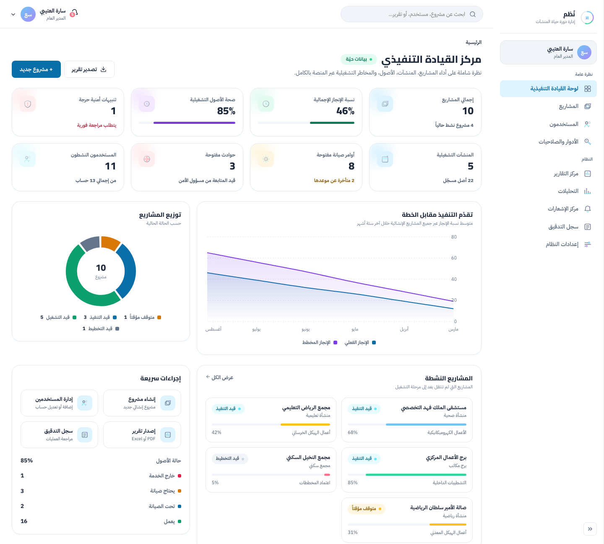
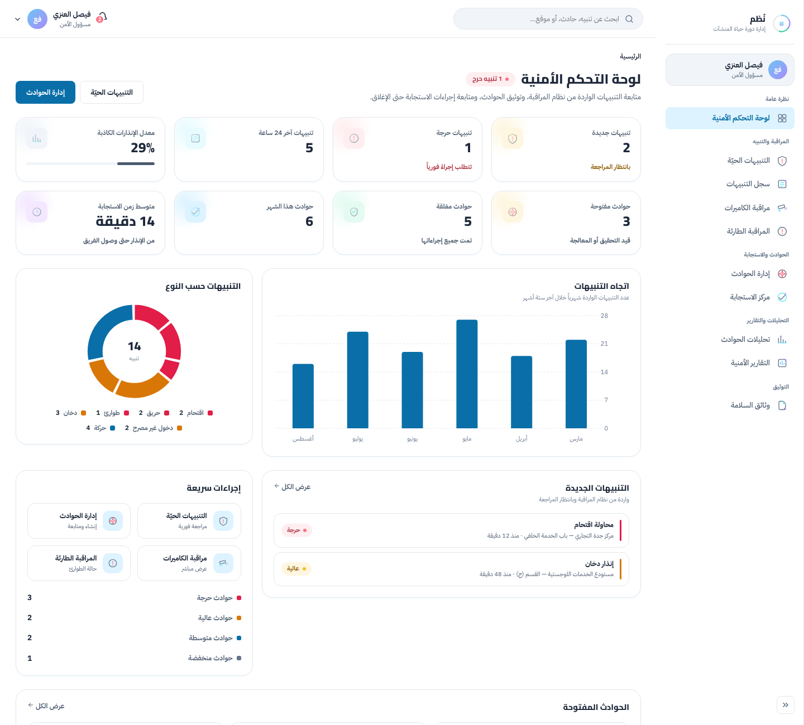
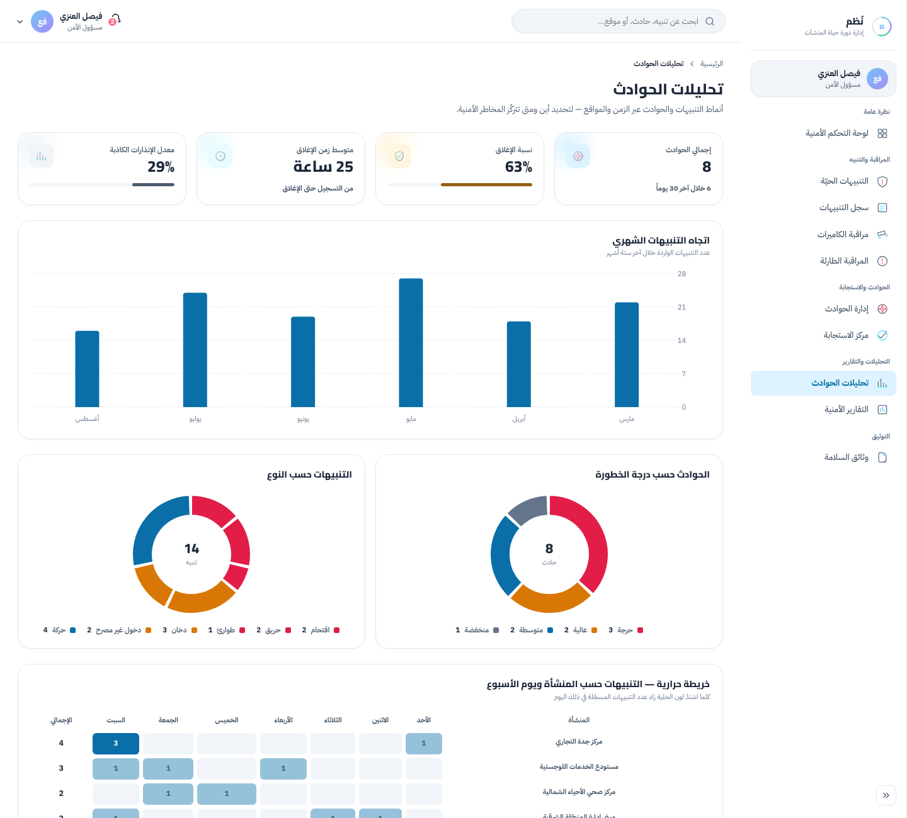
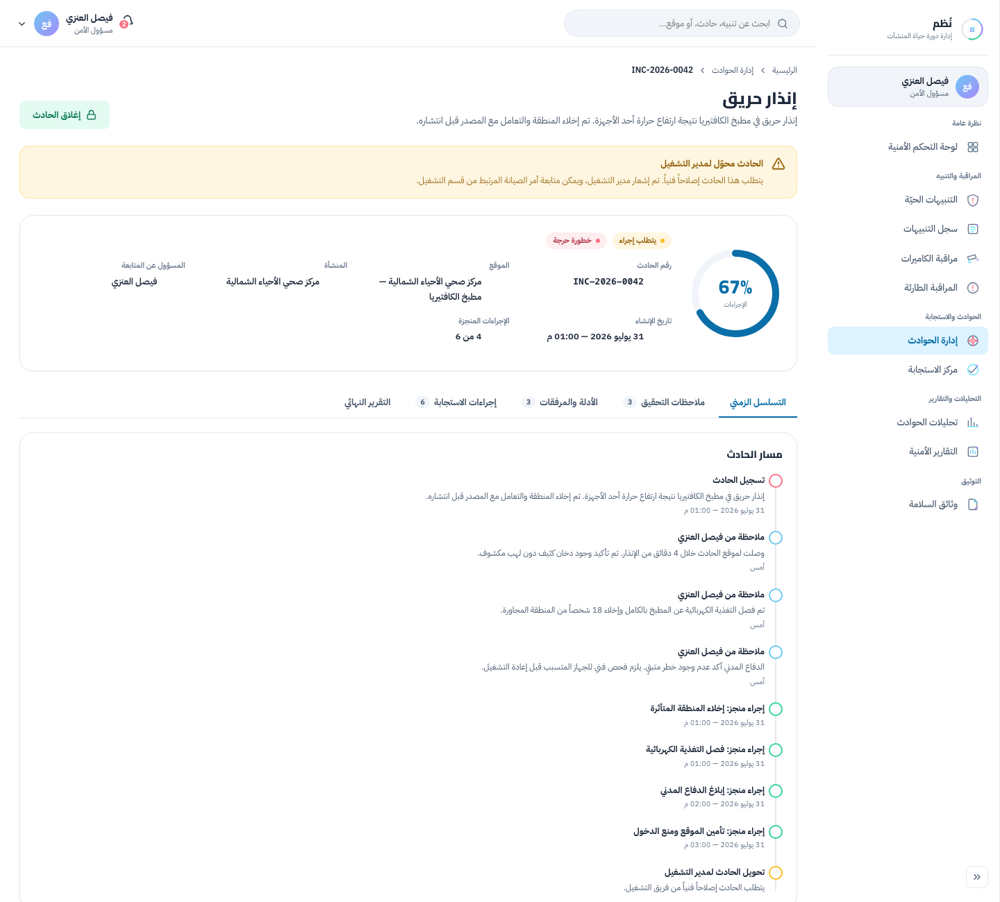

<h1 align="center">نُظم — منصة إدارة دورة حياة المنشآت</h1>

<p align="center">
  مشروع تخرج · واجهة أمامية (Frontend) · React + TypeScript
  <br />
  <strong>60 شاشة · عربية بالكامل · تعمل بدون إنترنت</strong>
</p>

<div dir="rtl">

---

## 👋 ابدأ من هنا

هذا الملف مكتوب **لشخص لم يعمل على مشاريع الويب من قبل**.

> 💻 كل الخطوات مكتوبة لنظام **Windows**.

**لتشغيل المشروع، اتبع 3 خطوات فقط:**

|     | الخطوة                                  | الوقت    |
| :-: | --------------------------------------- | -------- |
| 1️⃣  | [ثبّت Node.js](#الخطوة-1--ثبّت-nodejs)  | ~5 دقائق |
| 2️⃣  | [شغّل المشروع](#الخطوة-2--شغّل-المشروع) | ~3 دقائق |
| 3️⃣  | [سجّل الدخول](#الخطوة-3--سجّل-الدخول)   | فوراً    |

**واجهتك مشكلة؟** ← [المشاكل الشائعة وحلولها](#مشاكل-شائعة-وحلولها)

---

## الخطوة 1 — ثبّت Node.js

**برنامج واحد فقط.** لا تحتاج قاعدة بيانات ولا خادم ولا أي إعدادات.

> **ما هو Node.js؟** برنامج يمكّن حاسوبك من تشغيل المشروع. يأتي معه تلقائياً برنامج
> `npm` الذي ينزّل المكتبات التي يحتاجها المشروع.

### التحميل

🔗 **[https://nodejs.org/en/download](https://nodejs.org/en/download)**

اختر: **Windows** + **LTS** + **x64** ← اضغط التحميل.

### التثبيت

شغّل الملف المُنزَّل، ثم:

1. اضغط **Next** في كل الشاشات دون تغيير أي شيء
2. في شاشة `Tools for Native Modules` ← **اترك المربع فارغاً** ⬜
3. اضغط **Install** ← ثم **Yes** إن طلب صلاحيات ← ثم **Finish**
4. ⚠️ **أعد تشغيل الحاسوب** (مهم جداً — بدونها لن يعمل الأمر)

### تأكّد أنه نجح

اضغط زر `Windows` ← اكتب `powershell` ← اضغط Enter.

في النافذة التي تفتح، اكتب:

</div>

```powershell
node -v
```

<div dir="rtl">

- ✅ **ظهر رقم مثل `v22.16.0`؟** ممتاز، انتقل للخطوة التالية
- ❌ **ظهر خطأ؟** أعد تشغيل الحاسوب، وإن استمر أعد التثبيت

---

## الخطوة 2 — شغّل المشروع

### افتح الطرفية داخل مجلد المشروع

1. افتح مجلد `smart-facility-platform` في مستكشف الملفات
2. اضغط على **شريط العنوان** في الأعلى
3. امسح ما فيه واكتب `powershell` ← اضغط Enter

✨ ستفتح نافذة **وهي بالفعل داخل المجلد**.

### نزّل المكتبات (مرة واحدة فقط)

</div>

```powershell
npm install
```

<div dir="rtl">

⏱️ يستغرق 1–3 دقائق · 📶 هذه الخطوة الوحيدة التي تحتاج إنترنت

> ✅ **رسائل صفراء (`warn`)؟** طبيعي تماماً. المهم ألّا ترى `ERR!` بالأحمر.

### شغّل المشروع

</div>

```powershell
npm run dev
```

<div dir="rtl">

🎉 **سيفتح المتصفح تلقائياً!** وإن لم يفتح، اكتب في المتصفح: `http://localhost:5173`

### ملاحظات مهمة

|     |                                                                                         |
| --- | --------------------------------------------------------------------------------------- |
| ⚠️  | **لا تغلق نافذة PowerShell** — إغلاقها يوقف المشروع                                     |
| 🛑  | لإيقاف المشروع: `Ctrl + C`                                                              |
| 🔄  | لتشغيله لاحقاً: افتح المجلد ← `powershell` ← `npm run dev` فقط (**بدون** `npm install`) |
| ⚡  | أي تعديل تحفظه يظهر في المتصفح فوراً                                                    |

---

## الخطوة 3 — سجّل الدخول

> 💡 **الأسهل:** في صفحة الدخول ستجد الحسابات الأربعة أسفل النموذج.
> **اضغط على أي حساب وستُملأ بياناته تلقائياً.**

| الدور             | اسم المستخدم | كلمة المرور  |
| ----------------- | ------------ | ------------ |
| 👤 المدير العام   | `admin`      | `Admin@1234` |
| 🏗️ مدير الإنشاءات | `khalid`     | `Build@1234` |
| 🔧 مدير التشغيل   | `reem`       | `Ops@1234`   |
| 🛡️ مسؤول الأمن    | `faisal`     | `Guard@1234` |

**للتنقل بين الأدوار:** اضغط اسمك أعلى يسار الشاشة ← تسجيل الخروج ← ادخل بحساب آخر.

> ⚠️ **قبل العرض على اللجنة:** التغييرات التي تجريها تبقى محفوظة.
> لإعادة البيانات لحالتها الأصلية:
> **المدير العام ← إعدادات النظام ← «إعادة تعيين البيانات التجريبية»**

---

## 📖 ما هو هذا المشروع؟

منصة ويب لإدارة المنشأة (مستشفى، مدرسة، مركز تجاري…) **من أول يوم في موقع البناء
وحتى التشغيل اليومي**.

بدل أن تكون بيانات البناء في مكان، والصيانة في مكان آخر، والحوادث في ملفات منفصلة —
**كل شيء في نظام واحد**.

### دورة حياة المنشأة

</div>

```
①  إنشاء المشروع    →  المدير العام ينشئه ويُسنده لمدير إنشاءات
②  مرحلة البناء     →  المراحل · المواد · الجودة · التقارير
③  التسليم          →  بعد اكتمال كل المراحل ← يتحوّل لمنشأة تشغيلية
④  مرحلة التشغيل    →  الأصول · أوامر الصيانة · الأعطال
⑤  الأمن (مستمر)    →  التنبيهات · الحوادث · الإغلاق
```

<div dir="rtl">

### الأدوار الأربعة

| الدور                 | ماذا يفعل؟                                               | الشاشات |
| --------------------- | -------------------------------------------------------- | :-----: |
| 👤 **المدير العام**   | ينشئ المشاريع، يدير المستخدمين والصلاحيات، يصدر التقارير |   13    |
| 🏗️ **مدير الإنشاءات** | مراحل البناء، نسب الإنجاز، المواد، الجودة                |   14    |
| 🔧 **مدير التشغيل**   | الأصول، أوامر الصيانة، الأعطال                           |   14    |
| 🛡️ **مسؤول الأمن**    | التنبيهات الأمنية، الحوادث حتى الإغلاق                   |   12    |

\+ 4 شاشات تسجيل دخول و3 شاشات مشتركة = **60 شاشة**

### 3 حقائق مهمة

|                         |                                                                   |
| ----------------------- | ----------------------------------------------------------------- |
| 🖥️ **واجهة أمامية فقط** | لا يوجد خادم ولا قاعدة بيانات. البيانات تجريبية ومحفوظة في متصفحك |
| 🌐 **عربية بالكامل**    | كل النصوص عربية، والاتجاه من اليمين إلى اليسار                    |
| 📴 **بدون إنترنت**      | بعد التثبيت الأول، لا يحتاج المشروع أي اتصال إطلاقاً              |

---

## 📸 لقطات من المنصة

**تسجيل الدخول**


**لوحة القيادة التنفيذية — المدير العام**



**لوحة التحكم الإنشائية — مدير الإنشاءات**


**لوحة التشغيل — مدير التشغيل**


**لوحة التحكم الأمنية — مسؤول الأمن**



**الجدول الزمني للمشاريع**


**تحليلات الحوادث**



**تقويم الصيانة**


**مصفوفة الصلاحيات**


**تفاصيل الحادث**



---

## 🧭 ماذا تعرض أمام اللجنة؟

أفضل شاشة في كل دور:

| الدور       | افعل هذا                                                                                                                                         |
| ----------- | ------------------------------------------------------------------------------------------------------------------------------------------------ |
| 👤 `admin`  | **المشاريع ← «+ مشروع جديد»** — احفظ وسيظهر فوراً في القائمة<br />ثم **الأدوار والصلاحيات** — مصفوفة تفاعلية اضغط أي خانة                        |
| 🏗️ `khalid` | **مراحل التنفيذ ← افتح مرحلة ← «تحديث التنفيذ»** — حرّك الشريط لـ 100%<br />👀 ستتحوّل الحالة تلقائياً إلى «قيد المراجعة» ← ثم اعتمدها أو ارفضها |
| 🔧 `reem`   | **أوامر الصيانة ← افتح أمراً ← علّم البنود ← أغلق الأمر**<br />👀 اذهب لـ **مركز صحة الأصول** وستجد درجة صحة الأصل ارتفعت تلقائياً               |
| 🛡️ `faisal` | **التنبيهات الحيّة ← افتح تنبيهاً ← «تصعيد إلى حادث»**<br />أضف ملاحظات وإجراءات وأدلة ← ثم أغلق الحادث بتقرير نهائي                             |

---

## 📦 المكتبات المستخدمة

**12 مكتبة فقط.** كلها تُنزَّل تلقائياً عند `npm install` — **لا تحمّل أي شيء يدوياً**.

| المكتبة             | الإصدار | ما وظيفتها؟                                              | الموقع                                                   |
| ------------------- | :-----: | -------------------------------------------------------- | -------------------------------------------------------- |
| **React**           | 19.2.8  | بناء الواجهات بتقسيمها لقطع صغيرة قابلة لإعادة الاستخدام | [react.dev](https://react.dev)                           |
| **TypeScript**      |  6.0.3  | JavaScript + أنواع بيانات، تكتشف الأخطاء قبل التشغيل     | [typescriptlang.org](https://www.typescriptlang.org)     |
| **Vite**            |  8.2.0  | تشغّل المشروع وتُحدّث المتصفح فوراً عند أي تعديل         | [vite.dev](https://vite.dev)                             |
| **React Router**    | 7.18.2  | التنقل بين الصفحات                                       | [reactrouter.com](https://reactrouter.com)               |
| **TanStack Query**  | 5.101.4 | جلب البيانات، شاشات التحميل، تحديث القوائم تلقائياً      | [tanstack.com/query](https://tanstack.com/query/latest)  |
| **React Hook Form** | 7.84.0  | إدارة النماذج (14 نموذجاً في المشروع)                    | [react-hook-form.com](https://react-hook-form.com)       |
| **Zod**             |  4.4.3  | التحقق من المدخلات ورسائل الخطأ العربية                  | [zod.dev](https://zod.dev)                               |
| **Recharts**        | 3.10.1  | الرسوم البيانية                                          | [recharts.org](https://recharts.org)                     |
| **Lucide React**    | 1.28.0  | أيقونات عامة (سهم، إغلاق، رفع)                           | [lucide.dev](https://lucide.dev)                         |
| **clsx**            |  2.1.1  | دمج أسماء التنسيقات (300 بايت فقط)                       | [github.com/lukeed/clsx](https://github.com/lukeed/clsx) |
| **Fontsource**      |  5.3.0  | الخطوط العربية **مثبّتة داخل المشروع**                   | [fontsource.org](https://fontsource.org)                 |

> 💡 **لماذا الخطوط داخل المشروع؟** ليعمل المشروع **بدون إنترنت** — لا يُحمَّل أي خط
> من موقع خارجي.

**أدوات تطوير:** [Oxlint](https://oxc.rs) (فحص الكود) و [Prettier](https://prettier.io) (تنسيق الكود).

---

## ⌨️ الأوامر

| الأمر               | ماذا يفعل؟                                    |
| ------------------- | --------------------------------------------- |
| `npm install`       | ينزّل المكتبات — **مرة واحدة فقط**            |
| `npm run dev`       | 🚀 **يشغّل المشروع** — هذا ما ستستخدمه دائماً |
| `npm run build`     | يبني نسخة نهائية في مجلد `dist`               |
| `npm run preview`   | يعرض النسخة النهائية للتجربة                  |
| `npm run typecheck` | يفحص الأخطاء البرمجية                         |
| `npm run lint`      | يفحص جودة الكود                               |
| `npm run format`    | ينسّق كل الملفات تلقائياً                     |

---

## 📂 ملفات المشروع

**كل الكود في مجلد `src/`.** باقي الملفات إعدادات لن تلمسها.

</div>

```
src/
├── styles/tokens.css      🎨 الألوان والخطوط والمسافات
├── api/fixtures/          💾 البيانات التجريبية
├── components/            🧩 الأزرار والبطاقات والجداول والرسوم
├── features/              📄 الصفحات (مقسّمة حسب الدور)
├── routes/routeConfig.ts  🗺️ قائمة الشريط الجانبي
└── types/index.ts         📋 تعريف أنواع البيانات
```

<div dir="rtl">

| المجلد/الملف                                         |      هل تعدّله؟       |
| ---------------------------------------------------- | :-------------------: |
| `src/`                                               |   ✅ نعم، هنا العمل   |
| `node_modules/`                                      | ⛔ **لا تفتحه أبداً** |
| `dist/`                                              |   ❌ يُنشأ تلقائياً   |
| `package.json` · `vite.config.ts` · `tsconfig*.json` |      ❌ إعدادات       |

**امتدادات الملفات:**

| الامتداد      | المعنى                               |
| ------------- | ------------------------------------ |
| `.tsx`        | كود **+ واجهة مرئية** (أغلب الملفات) |
| `.ts`         | كود فقط بدون واجهة                   |
| `.module.css` | تنسيق **خاص بمكوّن واحد**            |
| `.css`        | تنسيق **عام**                        |

---

## ✏️ كيف تعدّل شيئاً؟

> تأكد أن `npm run dev` يعمل. كل تعديل تحفظه بـ `Ctrl + S` يظهر في المتصفح فوراً.

### 🎨 تغيير الألوان

افتح **`src/styles/tokens.css`** وغيّر القيم في الأعلى:

</div>

```css
--primary: #6ec6f4; /* اللون الأساسي — للتعبئة والرسوم */
--primary-dark: #0a6fa8; /* الغامق — للنصوص والأزرار */
--primary-tint: #ddf3ff; /* الفاتح — للخلفيات */
```

<div dir="rtl">

سيتغيّر اللون في **كل** المشروع فوراً.

> ⚠️ إذا غيّرت `--primary-dark` (لون النصوص)، تأكد أنه **غامق بما يكفي** ليُقرأ على
> الخلفية البيضاء.

### 📝 تغيير نص

1. افتح ملف الصفحة من `src/features/`
2. اضغط `Ctrl + F` وابحث عن النص
3. غيّره واحفظ

**مثال:** لتغيير عنوان لوحة المدير العام، افتح
`src/features/super-admin/pages/AdminDashboardPage.tsx` وابحث عن `مركز القيادة التنفيذي`.

### 📊 تغيير البيانات التجريبية

كل البيانات في **`src/api/fixtures/`**:

| الملف             | المحتوى                  |
| ----------------- | ------------------------ |
| `users.ts`        | المستخدمون               |
| `projects.ts`     | المشاريع والمراحل        |
| `construction.ts` | المواد والجودة والتقارير |
| `operations.ts`   | المنشآت والأصول والصيانة |
| `security.ts`     | التنبيهات والحوادث       |
| `system.ts`       | الإشعارات وسجل التدقيق   |

> ⚠️ **بعد تعديل البيانات**، اذهب إلى
> **المدير العام ← إعدادات النظام ← إعادة تعيين البيانات التجريبية**
> — لأن المتصفح يحتفظ بنسخة قديمة.

### 🗺️ تغيير الشريط الجانبي

افتح **`src/routes/routeConfig.ts`** وغيّر `label`:

</div>

```ts
{ path: '/admin/projects', label: 'المشاريع', icon: 'projects' },
```

<div dir="rtl">

هذا الملف يتحكّم في **الشريط الجانبي** و**مسار التنقل** و**ترتيب الصفحات** معاً.

---

## مشاكل شائعة وحلولها

### ❌ `'node' is not recognized`

**السبب:** لم تُعد تشغيل الحاسوب بعد تثبيت Node.js.

**الحل:** أعد تشغيل الحاسوب. إن استمرت، أعد التثبيت من
[nodejs.org](https://nodejs.org/en/download).

---

### ❌ `npm.ps1 cannot be loaded because running scripts is disabled`

**مشكلة شائعة جداً على Windows.** PowerShell يمنع تشغيل السكربتات افتراضياً.

**الحل الأسهل:** استخدم **Command Prompt** بدل PowerShell:

اضغط `Windows` ← اكتب `cmd` ← Enter ← ثم انتقل لمجلد المشروع ونفّذ الأوامر عادي.

<details dir="rtl">
<summary><strong>حل بديل (تفعيل السكربتات)</strong></summary>

<br />

افتح PowerShell **كمسؤول** (زر الفأرة الأيمن ← `Run as administrator`):

```powershell
Set-ExecutionPolicy -Scope CurrentUser RemoteSigned
```

اكتب `Y` ← Enter ← أغلق النافذة وافتح واحدة جديدة.

</details>

---

### ❌ `Could not read package.json`

**السبب:** أنت لست داخل مجلد المشروع.

**الحل:** اكتب `dir` — يجب أن ترى `package.json` في القائمة. إن لم تره، أعد فتح
الطرفية من داخل المجلد الصحيح.

---

### ❌ `Port 5173 is in use`

✅ **لا مشكلة!** سيختار المشروع منفذاً آخر تلقائياً (5174 مثلاً).
**استخدم الرابط الظاهر في الطرفية.**

---

### ❌ الصفحة بيضاء فارغة

1. اضغط `F12` ← تبويب **Console**
2. اقرأ الرسالة الحمراء — تخبرك باسم الملف ورقم السطر
3. جرّب `Ctrl + Shift + R` لإعادة تحميل كاملة

---

### ❌ البيانات غريبة أو ناقصة

**السبب:** نسخة قديمة محفوظة في المتصفح.

**الحل:** المدير العام ← إعدادات النظام ← **إعادة تعيين البيانات التجريبية**

---

### ❌ رسائل صفراء أثناء `npm install`

✅ **طبيعي تماماً.** كلمات `warn` و `deprecated` مجرد تنبيهات.
**المهم ألّا ترى `ERR!` بالأحمر.**

---

### ❌ التعديلات لا تظهر

1. تأكد أنك حفظت الملف (`Ctrl + S`)
2. تأكد أن `npm run dev` ما زال يعمل
3. جرّب `Ctrl + Shift + R`

---

### ❌ `npm audit` يظهر تنبيه أمني

يظهر تنبيه واحد على React Router **لا ينطبق على مشروعنا** — يخصّ ميزة «وضع RSC»
(مكوّنات الخادم) ومشروعنا لا يستخدمها.

> ⛔ **لا تنفّذ `npm audit fix --force`** — جُرِّب فظهر **14 تنبيهاً** بدل واحد.

---

## ⚠️ حدود النسخة الحالية

بكل شفافية:

| الحد                      | التفصيل                                                         |
| ------------------------- | --------------------------------------------------------------- |
| **لا يوجد خادم**          | البيانات في متصفحك فقط. على حاسوب آخر ستبدأ من البيانات الأصلية |
| **تسجيل الدخول تجريبي**   | كلمات المرور مكتوبة صراحة في `src/api/auth.ts`                  |
| **رفع الملفات محاكاة**    | يمكنك اختيار ملف وسيظهر اسمه وحجمه، لكن لا خادم يستقبله         |
| **تصدير التقارير محاكاة** | يُسجَّل التقرير في القائمة، لكن توليد ملف PDF مهمة الخادم       |
| **لا توجد اختبارات آلية** | فُحص المشروع بمسح آلي لكل الشاشات، لكن بلا Unit Tests           |

### ✅ ما تم فحصه

| الفحص                        | النتيجة                                  |
| ---------------------------- | ---------------------------------------- |
| فحص الأخطاء البرمجية         | **صفر أخطاء**                            |
| فحص جودة الكود               | **صفر أخطاء وتحذيرات**                   |
| بناء نسخة الإنتاج            | **ناجح**                                 |
| فحص آلي لكل الشاشات في متصفح | **56/56 تعمل** بدون خطأ                  |
| إمكانية الوصول               | لا يوجد زر أو حقل بلا اسم لقارئ الشاشة   |
| التجاوب                      | يعمل على الجوال والحاسوب بدون تمرير أفقي |

---

## 🔌 ربط المشروع بخادم لاحقاً

المشروع مصمّم بحيث **لا تحتاج تعديل أي صفحة**.

مجلد `src/api/` هو **الطبقة الوحيدة التي تعرف من أين تأتي البيانات**. الصفحات لا تعرف
ذلك — هي فقط تطلب «أعطني قائمة المشاريع» وتعرض النتيجة.

**الخطوات:**

1. أضف عنوان الخادم في ملف `.env`
2. عدّل `src/api/client.ts` ليستخدم `fetch` بدل القراءة من المتصفح
3. استبدل محتوى الدوال في `src/api/*.ts` بطلبات للخادم
4. احذف `src/api/db.ts` و `src/api/fixtures/`

✅ باقي المشروع يبقى كما هو تماماً.

---

## 📖 مسرد المصطلحات

| المصطلح               | المعنى                                              |
| --------------------- | --------------------------------------------------- |
| **Frontend**          | الواجهة الأمامية — كل ما يراه المستخدم في المتصفح   |
| **Backend**           | الخادم الذي يحفظ البيانات. **غير موجود في مشروعنا** |
| **مكوّن** (Component) | قطعة واجهة قابلة لإعادة الاستخدام — زر، بطاقة، جدول |
| **مكتبة** (Package)   | كود جاهز نستخدمه بدل كتابته من الصفر                |
| **`node_modules`**    | مجلد المكتبات المنزّلة. **لا تفتحه**                |
| **`package.json`**    | ملف قائمة المكتبات والأوامر                         |
| **PowerShell**        | نافذة تكتب فيها أوامر نصية                          |
| **`localhost`**       | «حاسوبي أنا» — المشروع يعمل على جهازك فقط           |
| **المنفذ** (Port)     | رقم يميّز التطبيق. مشروعنا يستخدم 5173              |
| **`localStorage`**    | تخزين داخل المتصفح. هنا تُحفظ بيانات مشروعنا        |
| **RTL**               | الاتجاه من اليمين إلى اليسار (العربية)              |
| **CSS**               | لغة التنسيق: الألوان والمسافات والأحجام             |


</div>
